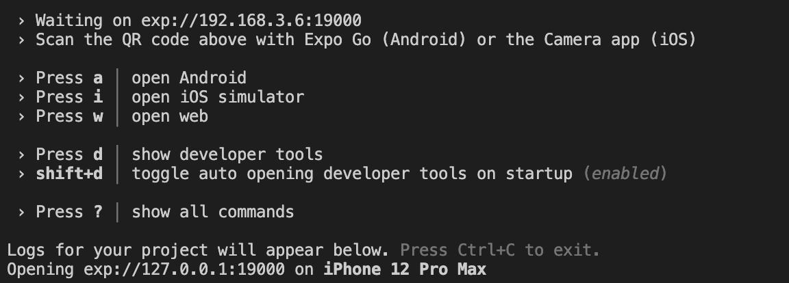
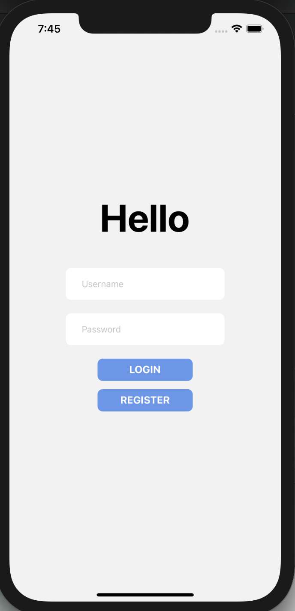
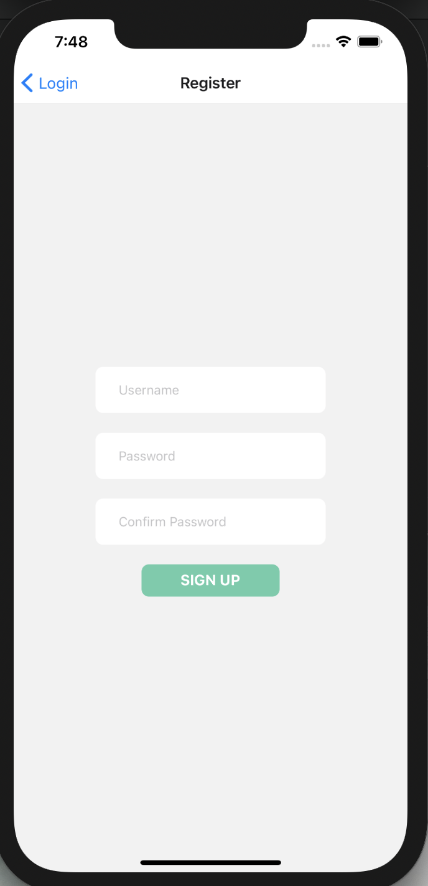
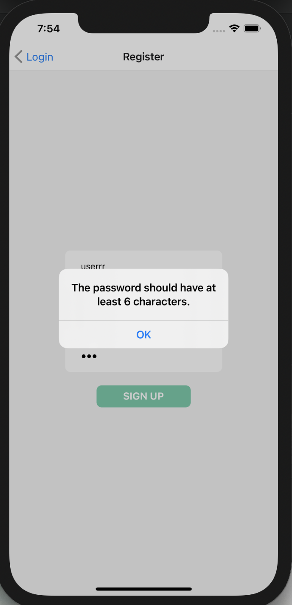
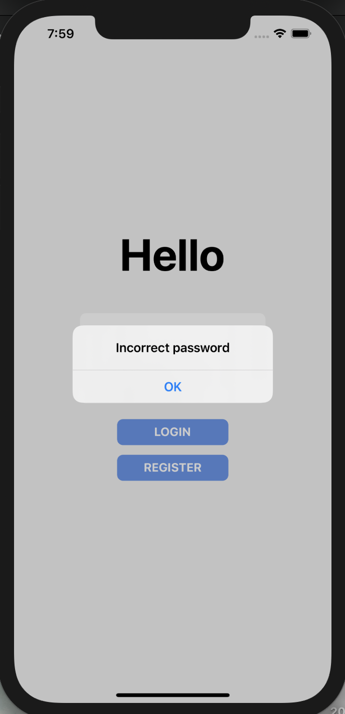
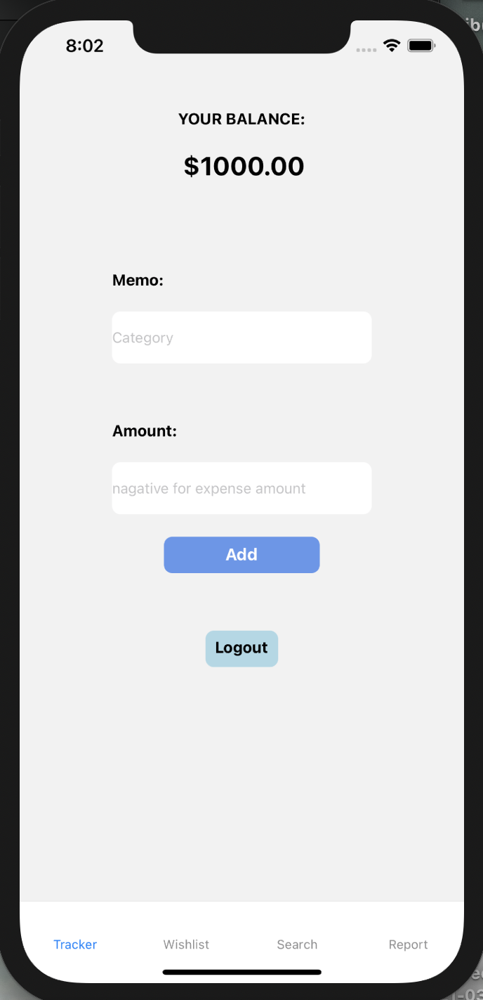

## Prerequisite

#### The following OS should be used for testing
- Mac OS X
- Linux
- Windows 7

#### Testing IDE
- Visual Studio Code

#### Project Requirement
- Expo
- JavaScript
- React Native
- Firebase
- Eslint


---
## Project Setup

- git clone https://gitlab.engr.illinois.edu/ziningc2/sp21-cs242-project

- cd sp21-cs242-project

- Open the project in VSCode

- Make sure you have React Native packages dependencies installed
  

---
## Manual Tests
- To start the project, run the App using following command

    ```cd my-app```

    ```npm start```

- You should be seeing this in terminal



- You can run the App on an iOS simulator using XCode or Web Server

- This is the main screen



### Register

- If you are new to the App, you should go to the register page. After click the **REGISTER** button



You will have the sign up page to enter your username and password, and confirm your password. Password input are text secured.

- If your **password** and **Confirm password** does not match


You will receive the notification like this. You should click **OK** and re-enter

- If you enter password less than 6 characters



You will receive the notification like this. You should click **OK** and re-enter

- If you enter a valid username and password and click **SIGN UP**

*You will be guided to the main page. And your information will be inserted into the Firebase.*


### Login

- If you've already registered. You can go to the **Login** Screen and enter username and password. Password is text secured.

- If your password does not match your username as registered before



You will receive the notification like this. You should click **OK** and re-enter

- If you enter correct username and password and click **LOGIN**



You will be guided to the main screen of the App


### Application Main Page

- This the main screen of the Application


You can see there are four tabs in the bottom, each for the *expense tracker*, *wish list*, *search*, and *Report*.

You can see the **YOUR BALANCE** on the top showing your total balance. And the **Memo** below is used for the user to input the Category of a transaction. The **Amount** is for the user to input the amount of a transaction. For example *300* means an income of $300, and *-500* means an expense of $500. There's also a **Logout** button for logging out. 

- If you click the **Logout** button


You will be guided back to the login page.

- Click **Add** to add the expense/income to the tracker

---
### TO DO 
