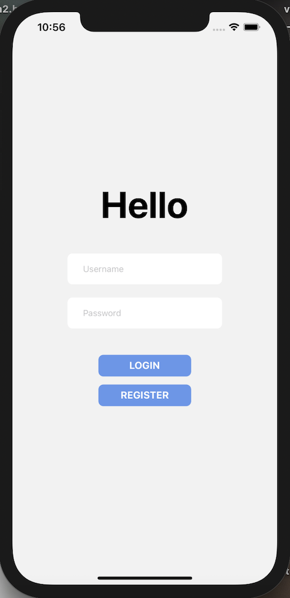

## Manual Test plan (updated in week3)
## Prerequisite

#### The following OS should be used for testing
- Mac OS X
- Linux
- Windows 7

#### Testing IDE
- Visual Studio Code

#### Project Requirement
- Expo
- JavaScript
- React Native
- Firebase
- Eslint


---
## Project Setup

- git clone https://gitlab.engr.illinois.edu/ziningc2/sp21-cs242-project

- cd sp21-cs242-project

- Make sure you have React Native packages dependencies installed (checkout package.json)

- You should create a *login_db.js* file in *my-app/database* setting up personal firebase configuration

```ruby
import firebase from 'firebase/app';
import 'firebase/database';

const firebaseConfig = { 
apiKey: '',
authDomain: '',
databaseURL: '',
projectId: '',
storageBucket: '',
messagingSenderId: '',
appId: '',
measurementId: '',
};

firebase.initializeApp(firebaseConfig);
const loginDb = firebase.database();
export default loginDb;
```
  
---
## Manual Tests
- To start the project, run the App using following command

    ```cd my-app```

    ```npm start```

- You should be seeing this in terminal

- You can run the App on an iOS simulator using XCode.

    *The frontend design is mainly iOS targeted*

---

### Register

- If you are new to the App, you should go to the register page. After click the **REGISTER** button

| Main Page | Register page |
|:---------------:|:-------------:|
|  |  |

 Password input are text secured.

- INVALID **password** and **Confirm password** 

| Password not match | Password too simple |
|:---------------:|:-------------:|
|  |  |


You will receive notifications like this. You should click **OK** and re-enter

- If you enter a valid username and password and click **SIGN UP**

*You will be guided to the main page. And your information will be inserted into the Firebase.*

---

### Login

- If you've already registered. You can go to the **Login** Screen and enter username and password. Password is text secured.

- Invalid username or password

| Username not registered | Incorrect password |
|:---------------:|:-------------:|
|  |  |

You will receive notifications like this. You should click **OK** and re-enter

- If you enter correct username and password and click **LOGIN**. You will be guided to the main screen of the App


### Application Main Page

- This the main screen of the Application

| Select category | Input amount |
|:---------------:|:-------------:|
|  |  |

You can see there are four tabs in the bottom, each for the *expense tracker*, *wish list*, *Report*, and *Me*.

**YOUR BALANCE** on the top shows your total balance and the current date. The **Category** and **Amount** below allow user to input the a transaction. There's also a **Logout** button. 

- Scroll to select the **Category** and enter amount. Click **Add** to add to the tracker

For example *300* means an income of $300, and *-500* means an expense of $500. Certain amount will be added/deducted from the balance.

- **RESET** button to reset the expense tracker

---

### Expense Tracker

- The balance amount is hided at first.

| Hided | Show |
|:---------------:|:-------------:|
|  |  |


---

### Wish List

- Click the **Wishlist** tab, you will be brought to the main Wish list screen.

| Default screen | Wish list information with valid url |
|:---------------:|:-------------:|
|  |  |

Enter url in the input box to add stuff to your wishlist. After a short loading scene, the information of the product of your url will be rendered in the wishlist screen, and will be stored into database. 

- If you enter an invalid url


You will receive an alert message.

- If you click the image

| Default website screen | Wishlist product website screen |
|:---------------:|:-------------:|
|  |  |

After a short loading scene, you will be guided to the official Amazon website of the wish list product.

- You can click the **Back** button on the top right corner to go back to the wishlist screen.

---

### Report

- This is the report page


User can click on either button to generate corresponding chart. There's also a **share** button/

- Charts Example

| Default  | Goal amount is set|
|:---------------:|:-------------:|
|  |  |

___

### Profile

- This is the Profile *Me* Screen

| Monthly balance | Categorical expense | Categorical income |
|:---------------:|:-------------:| :-------------:|
|  |  |  |


- Input a amount and click **OK**

The user-input goal amount will be stored into database and rendered on screen.

- **Go Random** clicked

A random number from 1000~6000 will be generated as a goal amount.

- Limited time on setting goal amount


If user tries to set multiple times, you will receive an alert message.

___

### TO DO
